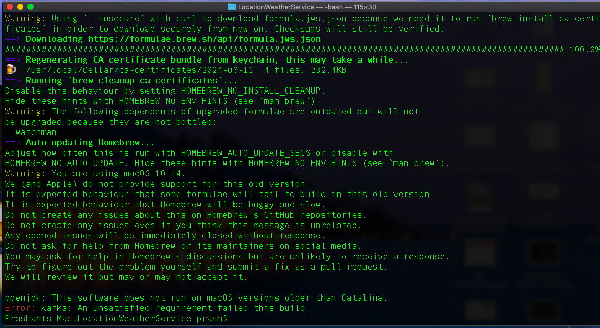

**Assumptions**

* Kafka streams the data in the json format with the given data.
* The weather API can be used from a python-library as well for simplicity. 
* Instead of creating a SQL `User` table with all relevant information, just using dictionary here.

---

**Getting Started**

* Run cmd: `make all` in the Terminal. This should create the Kafka Broker service and start the FastAPI service, as mentioned in the Makefile.
* Open the browser and hit the url: https://0.0.0.0:8080/. This will open the Swagger documentation.
* Or directly use the GET endpoint: https://0.0.0.0:8080/user/{user-id} For demo, user-id can be 81325.

---

**Next Steps**

* The error handling can be improved for various cases, instead of just one error-code 404, currently. 
* Unit and Integration tests should be added for the functionality and the service.
* The user-data along with location and weather can be stored and fetched from DB.
* A better more-accurate weather-service provider can be chosen depending upon the need. 
* Instead of simple pip - requirements file, Poetry toml can be used to better manage the dependencies.

---

**Resources**

* I googled for free weather services API. Found few opensource with minimal usage and also some available with python-library.
* Created the docker-compose file for Kafka with help of ChatGPT. But it had too many issues to be fixed one such issue is with the network settings.
* Also I have an old personal MacBook on which I'm unable to install kafka locally to use due to MacOS version issue.

  